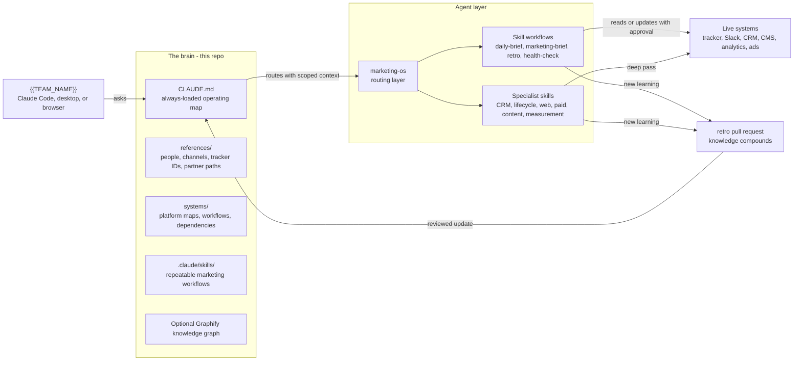
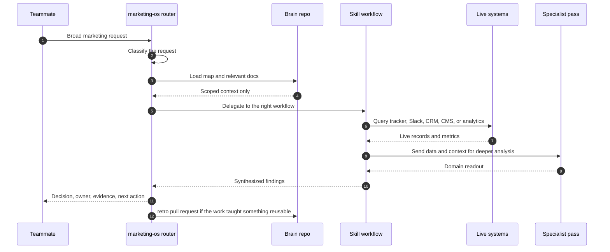
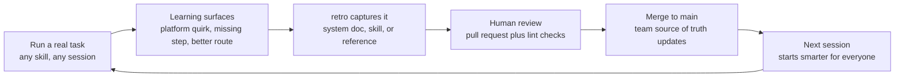
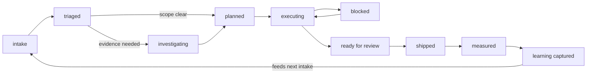

# {{TEAM_NAME}} - Marketing Brain

> {{TEAM_NAME}}'s operating brain for campaigns, channels, marketing systems, partner handoffs, and measurement. Structured for Claude, maintained by the team.

## Quick Start

Open Claude Code in this repo and say any of these:

| Say this | What happens |
|----------|--------------|
| "good morning" | Daily marketing brief with active work, blockers, Slack highlights, and next moves |
| "run the marketing OS" | Triage or plan broad marketing work across systems and channels |
| "create a task" | Campaign-ready tracker task with Why, Audience, Message, Channel, and Done When |
| "interview me" | Claude extracts marketing tribal knowledge and updates the repo |
| "let's retro" | Captures campaign or workflow learnings for next time |
| "health check" | Finds stale docs, missing references, and routing gaps |
| "what skills do you have?" | Lists available Marketing Brain workflows |

## Skills

| Skill | Trigger phrases | Description |
|-------|-----------------|-------------|
| `marketing-os` | "run the marketing OS", "triage marketing", "plan this campaign" | Top-level router for broad campaign, channel, planning, and performance work |
| `daily-brief` | "good morning", "morning brief", "catch me up" | Daily brief with active marketing work, blockers, Slack highlights, and actions |
| `marketing-brief` | "create a task", "write this up", "turn this into a brief" | Structured work-tracker task creation grounded in marketing context |
| `retro` | "let's retro", "capture what we learned" | Captures launch, campaign, and workflow learnings in the repo |
| `health-check` | "health check", "stale docs" | Checks freshness, placeholders, references, and skill routing |
| `knowledge-interview` | "interview me", "fill gaps", "brain dump" | Interview flow for extracting marketing tribal knowledge |
| `team-intro` | "tell me about the team", "onboard me" | Marketing team, systems, channels, and workflow overview |
| `list-skills` | "what skills do you have", "list skills" | Shows all available skills from the repo |
<!-- Add custom skills here as you create them -->

## Systems We Own

| System | Doc |
|--------|-----|
<!-- Systems are populated during setup and as you document more -->

See `systems/README.md` for templates. Say "teach me about [system name]" to fill in a real system doc.

## Team

**{{TEAM_NAME}}** - `#{{TEAM_SLACK_CHANNEL}}`

See `references/team.md` for the roster and focus areas.

## How This Repo Works

```text
CLAUDE.md (always loaded - the operating map)
  |
  +-- references/      (people, channels, boards, partner teams)
  +-- systems/         (marketing platforms, workflows, dependencies)
  +-- .claude/skills/  (repeatable workflows triggered by natural language)
```

Claude loads only the context needed for the current task. Details in `PHILOSOPHY.md`.

## How The System Works

### 1. The Platform At A Glance

Four stages, one direction of flow, one loop back: the marketing team asks Claude, Claude loads the brain, the Marketing OS routes work through skills, skills act on live systems, and reusable learning returns to the repo.



### 2. A Request, End To End

Broad requests start in `/marketing-os`. The router classifies the request, loads only the relevant context, delegates to a workflow skill, pulls live evidence when needed, and returns a decision-ready answer.



Safety rule: mutating writes, such as tracker updates, CRM changes, or Slack sends, pause for human approval unless the team has explicitly configured a trusted automation.

### 3. Progressive Disclosure, What Loads When

The brain is a map, not a library. A session starts with one operating file and pulls depth only when the task needs it, so context stays focused.

| Category | What Loads | When It Loads | Why It Matters |
|----------|------------|---------------|----------------|
| Always loaded | `CLAUDE.md` and high-level routing instructions | Every session | Gives Claude the team identity, operating rules, and pointers to everything else |
| On demand | `references/team.md`, `references/slack.md`, `references/monday_boards.md`, `systems/owned/*`, `systems/reference/*` | When a task mentions the team, channel, tracker, system, or partner path | Adds the right source-of-truth details without flooding the conversation |
| On trigger | `.claude/skills/*/SKILL.md` | When a natural-language trigger fires or `/marketing-os` delegates | Loads the exact workflow needed for the job |
| Deep, in a skill | `knowledge/` folders, field dictionaries, query notes, platform caveats | Mid-run, only when the skill needs extra depth | Keeps heavy reference material available without making every session carry it |
| Optional graph | `graphify-out/GRAPH_REPORT.md` or Graphify queries | When Graphify is installed and the team asks for graph-backed exploration | Helps explore relationships across systems, skills, docs, and references |

### 4. The Learning Flywheel

The repo gets smarter when every non-obvious learning lands in reviewed files instead of staying in one person's memory.



Rule of thumb: personal preferences can stay in memory; team and system knowledge belongs in the repo.

### 5. Operating State, How Work Moves

Every piece of work moves through a shared state loop, from intake to evidence, execution, measurement, and captured learning.



Reading the branches: triaged work moves straight to planned when the scope is clear, or through investigating when evidence is missing. Executing work can bounce through blocked and back. Nothing is truly done until the useful learning is captured.

## Adding To This Repo

- **New skill:** say "I want to create a skill for [workflow]"
- **New system doc:** say "teach me about [system name]"
- **Campaign learning:** say "let's retro" after launches, tests, reporting cycles, or messy workflows
- **Health check:** say "health check" monthly or after major team/system changes

## Optional Add-Ons

### Agent Flow

[Agent Flow](https://github.com/patoles/agent-flow) can be added as a real-time visualization layer for Claude Code and Codex runs. It lets the team watch the Marketing OS route work, branch into skills, call tools, and return learning as an interactive node graph.


Quick start:

```bash
npx agent-flow-app
```

For a modifiable local version:

```bash
git clone https://github.com/patoles/agent-flow.git
cd agent-flow
pnpm i
pnpm run setup
pnpm run dev
```

Open the visualizer, start a Claude Code or Codex session in this repo, and use it to inspect live routing, tool calls, token flow, and handoffs. Teams that prefer an editor panel can install the Agent Flow VS Code extension instead.

### Graphify

[Graphify](https://github.com/Graphify-Labs/graphify) can generate a visual, queryable knowledge graph from this repo when the team wants another way to explore systems, skills, references, and docs.

<video src="assets/graphify-knowledge-graph-demo.mov" controls muted playsinline title="Graphify knowledge graph demo"></video>

[Watch the Graphify demo](assets/graphify-knowledge-graph-demo.mov)

Install the CLI once:

```bash
uv tool install graphifyy
```

Then install the project skill for the assistant your team uses:

```bash
# Codex
graphify install --project --platform codex

# Claude Code
graphify install --project
```

Then run `$graphify .` in Codex or `/graphify .` in Claude Code. Generated files go into `graphify-out/` and `graph.json`, which should stay out of git and Claude context.

## Adoption Guide

See `docs/QUICKSTART.md` for the full playbook: first 30 minutes, first week, first month, decision trees, migration guidance, and common pitfalls.

<details>
<summary>Git hooks setup</summary>

This repo includes a pre-commit hook for secret scanning:

```bash
git config core.hooksPath .githooks
```

The hook runs automatically if configured. If `gitleaks` is unavailable, it falls back to a basic pattern check.

</details>
