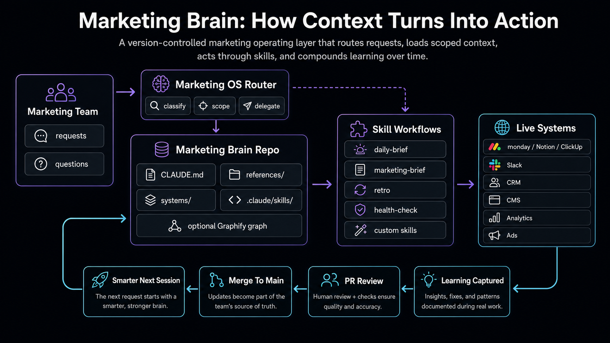
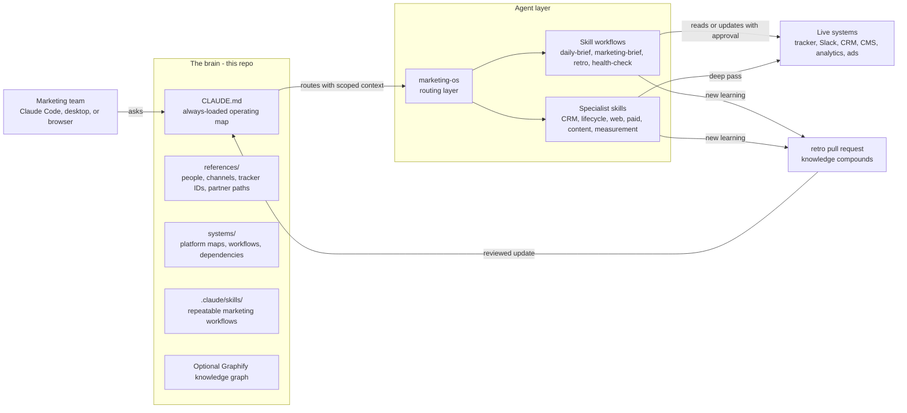
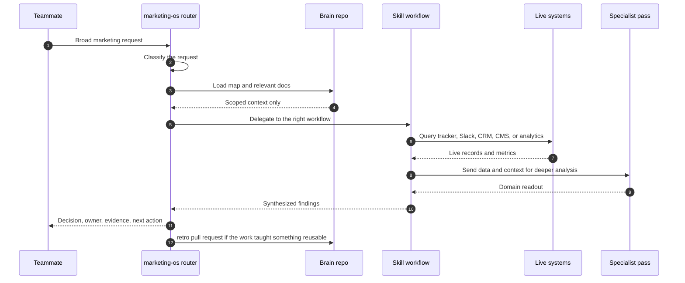
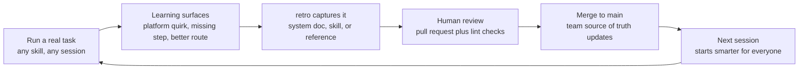
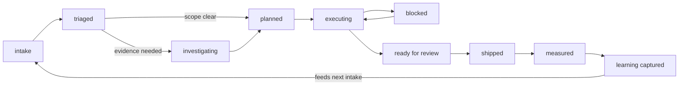
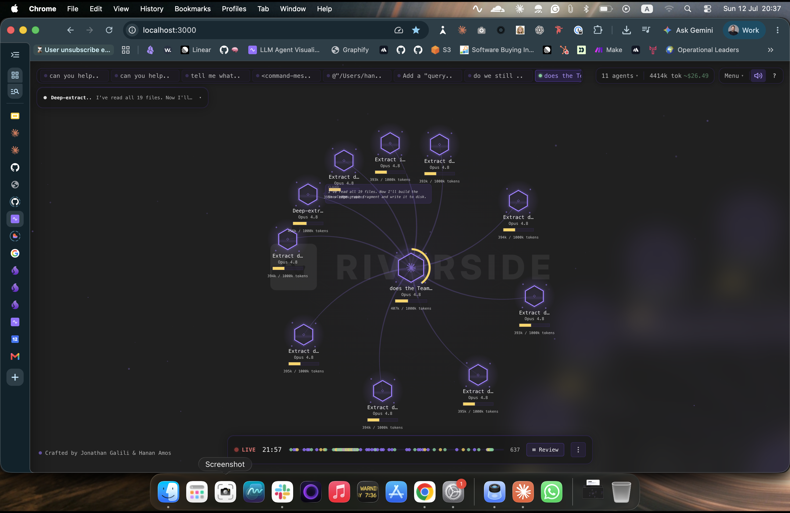

# Marketing Brain Starter

> A ready-to-fork operating kit for marketing teams that want Claude to understand their campaigns, channels, audiences, systems, boards, and launch rhythms from day one.

## What This Is



Marketing work moves across a lot of surfaces: campaign boards, Notion databases, ClickUp lists, CRM workflows, landing pages, ad accounts, analytics dashboards, Slack threads, launch calendars, and partner teams. Without a shared context layer, every AI conversation starts from scratch.

This starter gives your team a **Marketing Brain**: a version-controlled knowledge base and skill set that Claude can load progressively as it helps plan, triage, execute, measure, and learn from marketing work.

```text
CLAUDE.md (always loaded - the operating map)
  |
  +-- marketing-os     (top-level router for broad marketing work)
  +-- references/      (stable lookup data: people, channels, boards, partners)
  +-- systems/         (maps of marketing platforms, workflows, and dependencies)
  +-- .claude/skills/  (repeatable workflows triggered by natural language)
```

Claude loads only the context needed for the current request. Campaign learnings, workflow fixes, and platform gotchas go back into the repo, so the team gets smarter every time the work runs.

## How The System Works

### 1. The Platform At A Glance

Four stages, one direction of flow, one loop back: the marketing team asks Claude, Claude loads the brain, the Marketing OS routes work through skills, skills act on live systems, and reusable learning returns to the repo.



### 2. A Request, End To End

Broad requests start in `/marketing-os`. The router classifies the request, loads only the relevant context, delegates to a workflow skill, pulls live evidence when needed, and returns a decision-ready answer.



Safety rule: mutating writes, such as tracker updates, CRM changes, or Slack sends, pause for human approval unless the team has explicitly configured a trusted automation.

### 3. Progressive Disclosure, What Loads When

The brain is a map, not a library. A session starts with one operating file and pulls depth only when the task needs it, so context stays focused.

| Category | What Loads | When It Loads | Why It Matters |
|----------|------------|---------------|----------------|
| Always loaded | `CLAUDE.md` and high-level routing instructions | Every session | Gives Claude the team identity, operating rules, and pointers to everything else |
| On demand | `references/team.md`, `references/slack.md`, `references/monday_boards.md`, `systems/owned/*`, `systems/reference/*` | When a task mentions the team, channel, tracker, system, or partner path | Adds the right source-of-truth details without flooding the conversation |
| On trigger | `.claude/skills/*/SKILL.md` | When a natural-language trigger fires or `/marketing-os` delegates | Loads the exact workflow needed for the job |
| Deep, in a skill | `knowledge/` folders, field dictionaries, query notes, platform caveats | Mid-run, only when the skill needs extra depth | Keeps heavy reference material available without making every session carry it |
| Optional graph | `graphify-out/GRAPH_REPORT.md` or Graphify queries | When Graphify is installed and the team asks for graph-backed exploration | Helps explore relationships across systems, skills, docs, and references |

### 4. The Learning Flywheel

The repo gets smarter when every non-obvious learning lands in reviewed files instead of staying in one person's memory.



Rule of thumb: personal preferences can stay in memory; team and system knowledge belongs in the repo.

### 5. Operating State, How Work Moves

Every piece of work moves through a shared state loop, from intake to evidence, execution, measurement, and captured learning.



Reading the branches: triaged work moves straight to planned when the scope is clear, or through investigating when evidence is missing. Executing work can bounce through blocked and back. Nothing is truly done until the useful learning is captured.

## Quick Start

1. **Fork or copy this repo** into a repository your marketing team owns.
2. **Open Claude Code in the repo** and say: **"set up my marketing brain"**.
3. Answer the setup questions for your team, Slack channel, work tracker, owned marketing systems, and partner teams. The starter is wired for monday.com by default; Notion and ClickUp work as alternatives once you adapt the tracker references and skills.
4. Say **"good morning"** for your first daily marketing brief, or **"run the marketing OS"** to triage a broader request.

## What's Inside

| Skill | Say something like... | What it does |
|-------|-----------------------|--------------|
| `setup` | "set up my marketing brain" | One-time onboarding wizard that turns placeholders into your real marketing operating context |
| `marketing-os` | "run the marketing OS" | Routes broad marketing requests across campaign, content, CRM, web, paid, lifecycle, and measurement work |
| `daily-brief` | "good morning", "morning brief" | Daily brief with active marketing work, open blockers, Slack highlights, and recommended actions |
| `marketing-brief` | "create a task", "write this up" | Turns a request into a campaign-ready tracker brief with Why, Audience, Message, Channel, and Done When |
| `retro` | "let's retro" | Captures campaign and workflow learnings so the next launch starts ahead |
| `health-check` | "health check", "stale docs" | Finds stale system docs, missing references, and routing gaps |
| `knowledge-interview` | "interview me", "fill gaps" | Interviews the team to extract marketing tribal knowledge into durable docs |
| `team-intro` | "tell me about the team", "onboard me" | Gives new teammates a map of the team, systems, channels, and workflows |
| `list-skills` | "what skills do you have?" | Lists every available skill, read live from the repo |

Plus:

- **`references/`** - team roster, Slack channels, tracker boards/databases/lists, partner teams, and stable IDs
- **`systems/`** - templates and examples for CRM, lifecycle, website, paid, content, events, analytics, and partner-owned dependencies
- **Marketing Brain lint** (`.github/workflows/team-context-lint.yml`) - keeps skills well-formed and placeholder cleanup visible
- **Pre-commit secret scanning** (`.githooks/pre-commit`) - helps keep tokens and credentials out of the repo

## How It Grows

The starter is intentionally small. The intended path:

1. **Week 1:** run `/setup`, document your 2-3 highest-leverage marketing systems, and use `/daily-brief` daily.
2. **As you work:** end new or messy workflows with `/retro` so launch notes, channel learnings, and workflow fixes land in the repo.
3. **As you scale:** add specialist skills for CRM, lifecycle, paid acquisition, website, SEO, content, events, partner marketing, or measurement, then register them in `CLAUDE.md`.

`docs/QUICKSTART.md` has the full adoption playbook: first 30 minutes, first week, first month, decision trees, migration guidance, and common pitfalls.

## Principles

- **Marketing context, not generic documentation** - capture the audience, channel, offer, metric, owner, and decision path.
- **Pointers, not copies** - link to live boards, dashboards, CRM views, CMS pages, and campaign assets instead of duplicating data.
- **Repo over memory** - durable team knowledge belongs in reviewed files where the whole marketing org can benefit.
- **Every campaign teaches the next one** - retros turn one-off launch learning into reusable operating advantage.

## Requirements

- [Claude Code](https://claude.com/claude-code) (CLI, desktop, or web)
- Work tracking in monday.com by default, or Notion/ClickUp if you adapt the tracker references and skills
- Slack for team and partner communication
- Optional integrations as your team needs them: CRM, analytics, ad platforms, CMS, GitHub, Google Drive, Graphify, Agent Flow, or other marketing systems

## Optional Add-On: Agent Flow

[Agent Flow](https://github.com/patoles/agent-flow) can be added as a real-time visualization layer for Claude Code and Codex runs. It lets the team watch the Marketing OS route work, branch into skills, call tools, and return learning as an interactive node graph.



Quick start:

```bash
npx agent-flow-app
```

For a modifiable local version:

```bash
git clone https://github.com/patoles/agent-flow.git
cd agent-flow
pnpm i
pnpm run setup
pnpm run dev
```

Open the visualizer, start a Claude Code or Codex session in this repo, and use it to inspect live routing, tool calls, token flow, and handoffs. Teams that prefer an editor panel can install the Agent Flow VS Code extension instead.

## Optional Add-On: Graphify

[Graphify](https://github.com/Graphify-Labs/graphify) can turn this repo, docs, schemas, and media into a queryable knowledge graph when your team wants a visual map of how the Marketing Brain fits together.

<video src="assets/graphify-knowledge-graph-demo.mov" controls muted playsinline title="Graphify knowledge graph demo"></video>

[Watch the Graphify demo](assets/graphify-knowledge-graph-demo.mov)

Install the CLI once:

```bash
uv tool install graphifyy
```

Then install the project skill for the assistant your team uses:

```bash
# Codex
graphify install --project --platform codex

# Claude Code
graphify install --project
```

After installing it for the project, run `$graphify .` in Codex or `/graphify .` in Claude Code. Generated files go into `graphify-out/` and `graph.json`, which are ignored by git and Claude context.

## License

MIT - see `LICENSE`. Use it, fork it, make it your team's marketing brain.
